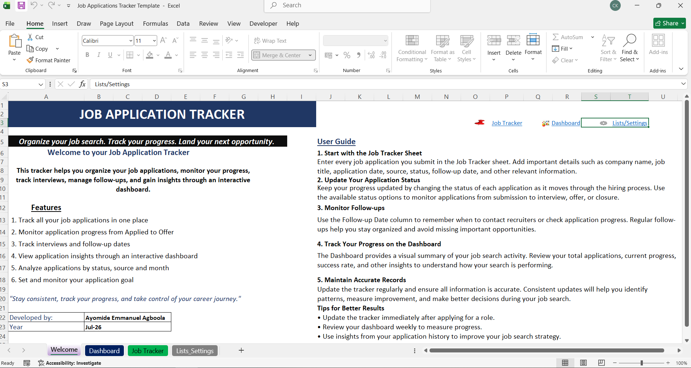

# Job Application Tracker (Excel)

A professional Microsoft Excel Job Application Tracker with an interactive dashboard for organizing applications, monitoring progress, and analyzing job search performance.

## Project Overview

The Job Application Tracker is designed to help job seekers manage their applications from a single workbook. It provides a structured way to record application details, monitor progress through different recruitment stages, and gain insights through an interactive dashboard.

This project was developed to demonstrate practical Microsoft Excel skills in solving a real-world problem. It showcases workbook design, interactive dashboards, formulas, data validation, structured data management, and user-friendly navigation, making it a valuable portfolio project for Excel, business analysis, and data analytics roles.

## Key Features

- Interactive dashboard for monitoring job application progress.
- Centralized job application tracker with structured data entry.
- Dropdown lists for consistent and accurate data input.
- Automatic calculations and summary metrics.
- User-friendly Welcome page with project introduction and navigation.
- Interactive navigation between workbook sections for a seamless user experience.
- Designed to help job seekers stay organized throughout their job search.

## Dashboard Preview

### Interactive Dashboard

### Welcome Page

### Job Tracker

## Workbook Structure

The workbook is organized into dedicated worksheets, each serving a specific purpose.

| Worksheet | Purpose |
|------------|---------|
| Welcome | Serves as the landing page with project information, key features, user guidance, and navigation to other worksheet. |
| Dashboard | Presents key metrics and visual insights about the job search. |
| Job Tracker | Stores and manages all job application records. |
| Lists | Contains the dropdown values used throughout the workbook for consistent data entry. |

